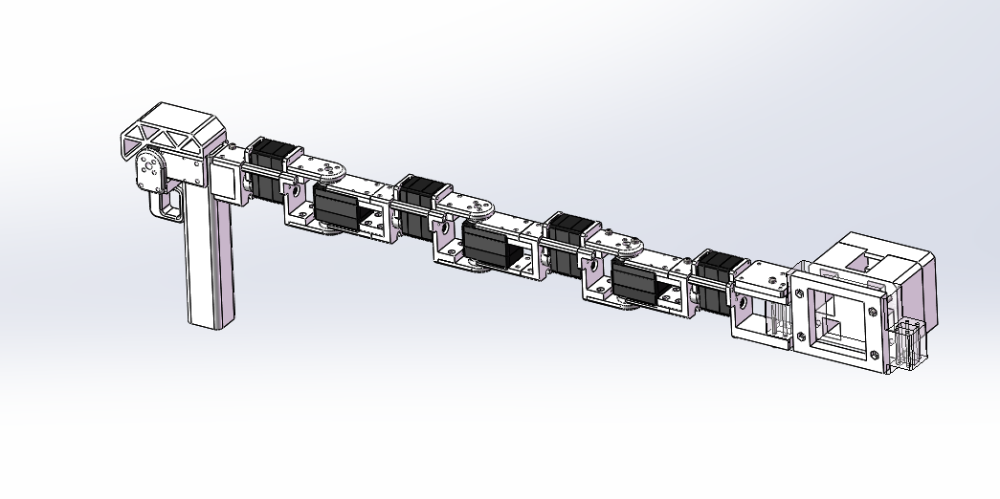

# teleop_8axis_realman_h2608

H2608 RealMan 八轴遥操作器及 ROS2 发布流程。

```sh
# launch ros node
cd .\ros 
source install/setup.sh
ros2 launch leader_3215_state_publisher real_joint7_state.launch.py

# get & publish 8-dof motor state
cd .\ros\src\arm8_realman_leader\scripts\
python arm7f_publisher.py
```


